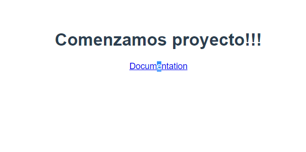

# FrontEnd Sprint 1
***
## Tabla de contenidos

1. [Creamos el proyecto](#creamos-proyecto)
2. [Item 2](#item2)()

## Tecnologías empleadas

 [](https://www.npmjs.com/package/vite)

## Recursos
- [Crear el archivo readme.md](https://www.ionos.es/digitalguide/paginas-web/desarrollo-web/archivo-readme/)
 ## Creamos el proyecto
- Creamos carpeta con nombre proyecto. La abrimos con vscode y abrimos un terminal.
- Creamos el proyecto con vite: (el punto es para que cree el proyecto en la carpeta en la que estamos ubicados con vscode)
   
    ```
    $ npm create vite .
    ```
  
- Instalamos las dependencias y abrimos un servidor de prueba
 
    ```
    $ npm install
    $ npm run dev
    ```
- Modificamos el título del proyecto y verificamos que todo está en orden




- Creamos repositorio en git y enlazamos con nuestra cuenta de github. Lo haremos mediante las herramientas de vscode.
- Ahora tenemos una rama *master* con el proyecto básico. Vamos a crear una rama de desarrollo *dev* a partir de la rama *master*
- Y creamos el primer commit de desarrollo: 'Comenzamos a desarrollar'


  
  

